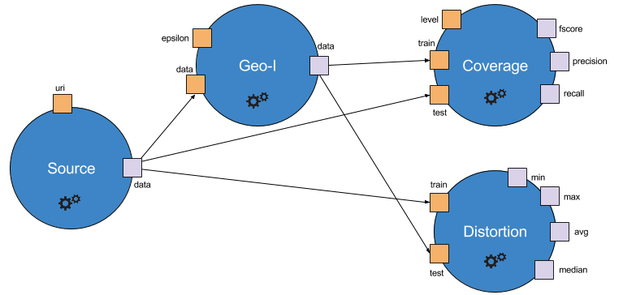

The following concepts are essential to understand how Accio behaves:

* TOC
{:toc}

## Operators

*Operators* are the basic building block of Accio.
They can be viewed as a function in a program: given some inputs, they produce some outputs.
Each operator comes with a very clearly defined interface: it defines the inputs it consumes and the outputs it produces, using a type system provided by Accio.
Inputs and outputs are sometimes referred to as *ports*.
Inputs may be defined as optional (i.e., the operator can be executed even if the input is not defined) or have a default value (i.e., this default value will be used if the input is not defined).
Input and outputs ports have a type; it allows the engine to enforce values are correct before running operators.
Outputs are always defined.
Operators need to be implemented by developers, but thanks to workflows, they can be later used even by non-developers.
Operators are always executed on a single machine.

Operators have a name, which must be unique across all operators registered in Accio.
They belong to a category and have a description, which is used to generate built-in documentation.

Generally speaking, operators are assumed to be deterministic.
It means that given some inputs, they are expected to produce the exact same outputs at each execution.
We support randomness through *unstable operators*.
Operators can be defined as unstable.
This unstable status can be defined depending on some inputs, but should be known before actually executing the operator.
Unstable operators are allowed to used a seed they have access to through the operator execution context.
This seed can be considered as an additional input and should be their only source of randomness.
It means that given some inputs **and a seed**, unstable operators are expected to produce the exact same outputs at each execution. 

## Workflows

A *workflow* is a directed acyclic graph, whose nodes are instances of operators. 

The above workflow is formed of four nodes, each with its own inputs (in orange) and outputs (in purple).
The `Source` node is the root node (i.e., it has no input from another node).
It accepts one input, `uri` and produces one output, `data`.
This output is then consumed as an input by nodes `Geo-I`, `Coverage` and `Distortion`.
It becomes clear that some inputs are filled from the output of another node (e.g, the `data` input of `Geo-I`), while some other are directly specified through a constant (e.g, the `epsilon` input of `Geo-I`).

When [specifying workflows](../usage/workflows.html), you essentially define a list of nodes.
Each node is an instance of a specific operator, has a name and some inputs.
The name of a node is by default the name of the operator it is an instance of.
However, you can freely give a node another name.
It is even required if you want to have multiple instances of the same operator inside a workflow, as node names are unique.
Each node also specifies its inputs, e.g., directly with a constant value or by connecting it to the output port of another node. 

Workflows can have parameters, which are values specified only at run time by the user.
Parameters can be thought as workflow-level inputs.
They allow the user to vary the value of one or several ports that take their value from a given parameter.
It means a given parameter can be used by multiple ports, though they obviously need to be of the same data type.

Workflows produce artifacts, which are workflow-level outputs.
Artifacts are all the outputs produced by every node in the workflow.
Artifacts are named after the node name and the output port name, separated by a slash (`/`).

While operators need to be implemented by developers, workflows can be defined very simply thanks to the [workflow definition language](../usage/workflows.html).

## Experiments and runs

Workflows are instantiated through experiments.
An experiment defines the way to launched one or several workflows in a row, with some variations.
Each instance of a workflow is called a run; runs are then aggregated into experiments.
An experiment can be as simple as a single run of a given workflow, or as complex as thousand runs, each one being a variation of the same workflow (e.g., to perform a parameter sweep).

Experiments and runs are identified with a globally unique identifier, which means there should not be two identical identifiers even experiments where launched on different machines.

Experiments can also be easily defined thanks to the [experiment definition language](../usage/experiments.html).